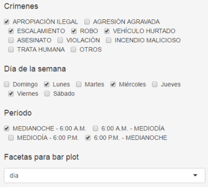

## URL
[https://carlosgg.shinyapps.io/mapa-crimen-pr/](https://carlosgg.shinyapps.io/mapa-crimen-pr/ "Mapa del crimen de Puerto Rico")

## Motivación

En la Florida, la oficina del alguacil del condado de Hillsborough tiene una [página](http://gis.hcso.tampa.fl.us/crimemapping/) que permite a los ciudadanos visualizar los delitos en un área dada. Es muy útil. 
Dada la elevada taza del crimen en Puerto Rico, pensé que sería de utilidad para la ciudadanía poder visualizar los delitos en un mapa de Puerto Rico interactivo.

## Tecnologías

[R](https://leanpub.com/rprogramming), [R Studio](https://www.rstudio.com/), [Shiny R server](http://shiny.rstudio.com/articles/), [Leaflet for R](http://rstudio.github.io/leaflet/), [ggmap](https://journal.r-project.org/archive/2013-1/kahle-wickham.pdf).

## Origen de los datos

Los datos fueron obtenidos a través del [Portal de Interconexión de Datos Abiertos de Puerto Rico](https://data.pr.gov/), específicamente [aquí](https://data.pr.gov/en/Seguridad-P-blica/Mapa-del-Crimen-Crime-Map/bkiv-k4gu).

Para proteger la privacidad de la ciudadanía, **las ubicaciones de todos los resultados han sido modificadas ligeramente, de manera que ninguna de las ubicaciones es exacta sino aproximada**.

## Cualidades

### Búsqueda en un radio

### Gráficos de barra (bar plots)

Los gráficos de barra son construídos en base a los filtros y las facetas seleccionados.

Por ejemplo, a continuación se muestra el bar plot correspondiente a una búsqueda de crímenes cometidos los lunes, miércoles, y viernes en la madrugada y por la noche, con faceta de día.

   

La imagen siguiente resultó de la misma búsqueda en la misma urbanización, pero con faceta de período del día

  

### Mapas de densidad

Los mapas de densidad toman un par de segundos. Son construídos de manera similar a los bar plots, es decir, en base a los filtros y la faceta seleccionados.

### Tabla

Aquí los resultados de la búsqueda son tabulados. La tabla también se construye en base a la faceta y los filtros seleecionados.

### Referencias

0. José Jorge and Policía de Puerto Rico. (2014). ***Incidencia Crime Map*** [CSV file]. Retrieved from https://data.pr.gov/en/Seguridad-P-blica/Incidencia-Crime-Map/3fy3-2bc5

1. Chow, Jo-fai. (2014, March 11). ***Introducing 'CrimeMap'***. Retrieved from http://www.jofaichow.co.uk/2014_03_11_LondonR/#1

2. Matloff, Norman. ***The Art of R Programming***. San Francisco: No Starch Press, 2011. PDF.

3. Adler, Joseph. ***R in a Nutshell, Second Edition***. Sebastopol: O'Reilly Media, 2012. PDF.

4. D. Kahle and H. Wickham. ***ggmap: Spatial Visualization with ggplot2***. The R Journal, 5(1), 144-161. URL http://journal.r-project.org/archive/2013-1/kahle-wickham.pdf

5. Veness, Chris. ***Calculate distance, bearing and more between Latitude/Longitude points***. Retrieved from http://www.movable-type.co.uk/scripts/latlong.html

6. Roger Peng. ***Computing for Data Analysis***, Spring 2014. Coursera.

7. Shiny Articles. Retrieved from http://shiny.rstudio.com/articles/

8. Hillsborough County Sheriff's Ofiice. ***Hillsborough County Crime Map***. Retrieved from http://gis.hcso.tampa.fl.us/crimemapping/

9. Samarasa and Jarpal. ***Fixing the order of facets in ggplot***. Retrieved from http://stackoverflow.com/questions/14262497/fixing-the-order-of-facets-in-ggplot

10. Stein, Jonas and Muspratt, Sandy. ***What does size really mean in geom_point?*** Retrieved from http://stackoverflow.com/questions/13548321/what-does-size-really-mean-in-geom-point
